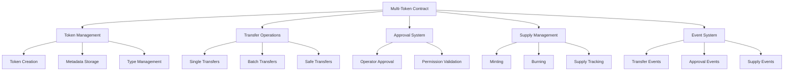

# Multi-Token Contract Design Document

## Overview

The multi-token contract system implements an ERC-1155 compatible smart contract that manages multiple token types within a single deployment. The system supports both fungible and non-fungible tokens, batch operations, and comprehensive approval mechanisms while maintaining gas efficiency and security.

## Architecture

The system follows a modular architecture with clear separation of concerns:



## Components and Interfaces

### Core Contract Interface

```clarity
;; Main contract interface
(define-trait multi-token-trait
  (
    ;; Balance queries
    (balance-of (principal uint) (response uint uint))
    (balance-of-batch ((list 50 {owner: principal, id: uint})) (response (list 50 uint) uint))
    
    ;; Transfer functions
    (safe-transfer-from (principal principal uint uint (optional (buff 256))) (response bool uint))
    (safe-batch-transfer-from (principal principal (list 50 {id: uint, amount: uint}) (optional (buff 256))) (response bool uint))
    
    ;; Approval functions
    (set-approval-for-all (principal bool) (response bool uint))
    (is-approved-for-all (principal principal) (response bool uint))
    
    ;; Supply management
    (mint (principal uint uint) (response bool uint))
    (burn (principal uint uint) (response bool uint))
    
    ;; Metadata
    (uri (uint) (response (string-ascii 256) uint))
    (total-supply (uint) (response uint uint))
  )
)
```

### Token Management Component

Handles token type creation, metadata storage, and type-specific configurations:

- Token type registration with unique identifiers
- Metadata URI storage and retrieval
- Supply tracking per token type
- Token type enumeration and validation

### Transfer Operations Component

Manages all token transfer operations with comprehensive validation:

- Single token transfers with safety checks
- Batch transfer operations for efficiency
- Balance validation and atomic operations
- Transfer hook integration for recipient validation

### Approval System Component

Implements operator approval patterns for delegated token management:

- Global approval for all token types
- Operator permission validation
- Approval state management and queries
- Security controls for unauthorized access

## Data Models

### Token Balance Storage

```clarity
;; Nested map: owner -> token-id -> balance
(define-map token-balances 
  {owner: principal, token-id: uint} 
  uint
)
```

### Token Metadata Storage

```clarity
;; Token type metadata
(define-map token-metadata
  uint ;; token-id
  {
    uri: (string-ascii 256),
    total-supply: uint,
    creator: principal,
    created-at: uint
  }
)
```

### Approval Storage

```clarity
;; Operator approvals: owner -> operator -> approved
(define-map operator-approvals
  {owner: principal, operator: principal}
  bool
)
```

### Contract State

```clarity
;; Global contract state
(define-data-var next-token-id uint u1)
(define-data-var contract-owner principal tx-sender)
```

## Correctness Properties

*A property is a characteristic or behavior that should hold true across all valid executions of a system-essentially, a formal statement about what the system should do. Properties serve as the bridge between human-readable specifications and machine-verifiable correctness guarantees.*

### Property Reflection

After reviewing all testable properties from the prework analysis, several properties can be consolidated to eliminate redundancy:

- Properties 2.1 and 2.2 (batch atomicity) can be combined into a single comprehensive atomicity property
- Properties 4.1 and 4.3 (minting effects) can be combined into a single minting property that covers both supply and balance updates
- Properties 6.1, 6.2, 6.4 (event emission) can be consolidated into comprehensive event emission properties
- Properties 7.1, 7.2, 7.3, 7.4 (validation) can be grouped into input validation and security properties

The following properties provide unique validation value and will be implemented:

**Property 1: Token ID Uniqueness**
*For any* sequence of token creation operations, each new token should receive a unique identifier that has never been used before
**Validates: Requirements 1.2**

**Property 2: Metadata Persistence**
*For any* token created with metadata, querying that token's metadata should return exactly the same data that was stored
**Validates: Requirements 1.4**

**Property 3: Batch Transfer Atomicity**
*For any* batch transfer operation, either all individual transfers succeed and balances update correctly, or the entire operation fails and no balances change
**Validates: Requirements 2.1, 2.2**

**Property 4: Balance Validation**
*For any* transfer operation, the sender must have sufficient balance for each token type being transferred, or the operation should be rejected
**Validates: Requirements 2.3, 7.2**

**Property 5: Approval Authority**
*For any* approved operator, they should be able to transfer tokens on behalf of the owner for all token types, and unapproved operators should be rejected
**Validates: Requirements 3.2, 3.3**

**Property 6: Approval Isolation**
*For any* two different owner-operator pairs, setting approval for one pair should not affect the approval status of the other pair
**Validates: Requirements 3.5**

**Property 7: Supply Consistency**
*For any* mint or burn operation, the total supply and individual balances should be updated atomically and consistently
**Validates: Requirements 4.1, 4.2, 4.3**

**Property 8: Burn Validation**
*For any* burn operation, attempting to burn more tokens than available should be rejected and leave balances unchanged
**Validates: Requirements 4.4**

**Property 9: Balance Query Accuracy**
*For any* balance query (single or batch), the returned values should exactly match the current stored balances for the specified address-token pairs
**Validates: Requirements 5.1, 5.2**

**Property 10: Event Emission Completeness**
*For any* transfer, approval, mint, or burn operation, appropriate events should be emitted with all necessary data for off-chain tracking
**Validates: Requirements 6.1, 6.2, 6.3, 6.4, 6.5**

**Property 11: Input Validation**
*For any* operation with invalid inputs (addresses, mismatched arrays, unauthorized access), the operation should be rejected with appropriate errors
**Validates: Requirements 7.1, 7.3, 7.4**

**Property 12: Standard Compliance**
*For any* standard ERC-1155 operation, the contract should behave according to the specification and emit compliant events
**Validates: Requirements 8.2, 8.3**

## Error Handling

The contract implements comprehensive error handling with specific error codes:

### Error Categories

1. **Input Validation Errors (100-199)**
   - Invalid addresses
   - Mismatched array lengths
   - Invalid token IDs
   - Invalid amounts

2. **Permission Errors (200-299)**
   - Unauthorized access
   - Insufficient approvals
   - Owner-only operations

3. **Balance Errors (300-399)**
   - Insufficient balance
   - Invalid burn amounts
   - Supply overflow/underflow

4. **State Errors (400-499)**
   - Contract paused
   - Invalid contract state
   - Reentrancy protection

### Error Handling Strategy

- All functions return `(response bool uint)` with specific error codes
- Critical operations use atomic updates to prevent partial state changes
- Input validation occurs before any state modifications
- Comprehensive logging for debugging and monitoring

## Testing Strategy

The multi-token contract will use a dual testing approach combining unit tests and property-based tests to ensure comprehensive coverage and correctness.

### Unit Testing Approach

Unit tests will cover:
- Specific examples demonstrating correct behavior for each function
- Edge cases like zero amounts, empty arrays, and boundary conditions
- Integration points between different contract components
- Error conditions and proper error message validation
- Event emission verification for specific scenarios

Unit tests provide concrete examples and catch specific bugs in implementation logic.

### Property-Based Testing Approach

Property-based tests will verify universal properties using **fast-check** library for JavaScript/TypeScript testing:

- Each property-based test will run a minimum of 100 iterations with random inputs
- Tests will generate random valid inputs to verify properties hold across all cases
- Each property-based test will be tagged with: `**Feature: multi-token-contract, Property {number}: {property_text}**`
- Properties will test invariants, round-trip behaviors, and system-wide correctness
- Random input generation will include edge cases and boundary conditions

Property-based tests verify that the contract behaves correctly across the entire input space and catch subtle bugs that specific examples might miss.

### Testing Framework Configuration

- **Unit Tests**: Vitest for fast execution and comprehensive assertion library
- **Property-Based Tests**: fast-check integrated with Vitest for random input generation
- **Contract Testing**: @stacks/transactions for Clarity contract interaction
- **Coverage**: Minimum 90% code coverage for all contract functions
- **Performance**: Tests should complete within 30 seconds for rapid development feedback

Both testing approaches are complementary: unit tests catch concrete implementation bugs while property-based tests verify general correctness across all possible inputs.

## Implementation Considerations

### Gas Optimization

- Batch operations reduce transaction costs by processing multiple operations in single calls
- Efficient storage patterns minimize storage slot usage
- Event emission optimized for indexing and monitoring needs

### Security Measures

- Reentrancy protection for all external calls
- Integer overflow/underflow protection using safe math
- Access control validation for administrative functions
- Input sanitization and validation for all public functions

### Scalability Features

- Support for up to 2^128 different token types
- Efficient balance storage using nested maps
- Batch operations for improved throughput
- Minimal storage footprint per token type

### Upgrade Considerations

- Immutable core logic for security and trust
- Extensible metadata system for future enhancements
- Event-based architecture for external system integration
- Standard-compliant interfaces for ecosystem compatibility