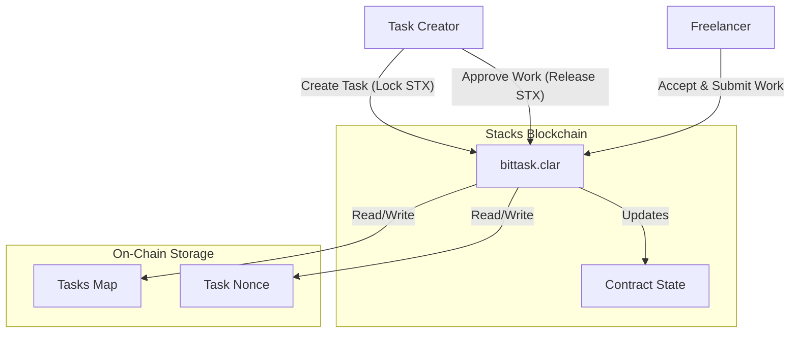
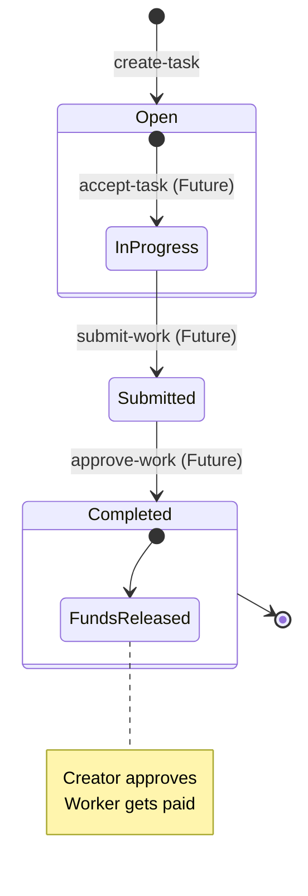

# BitTask - Decentralized Microgigs Marketplace

**BitTask** is a decentralized tasks marketplace built on **Stacks (Bitcoin L2)**. It enables users to post tasks with rewards paid in STX or sBTC, and allows workers to complete these tasks and get paid trustlessly via smart contracts.

  

## 🏗 System Architecture

The project consists of a Clarity smart contract (`bittask`) that manages the state of all tasks and holds funds in escrow. Users interact with the contract directly or through a Next.js frontend application.



## 🔄 Workflow

The lifecycle of a task follows a linear flow from creation to completion or dispute.



## ✨ Features

- **Create Tasks**: Users can post tasks with a title, description, deadline, and STX reward.
- **Trustless Escrow**: Funds are locked in the smart contract upon task creation, ensuring the creator cannot withhold payment arbitrarily.
- **Automated Bookkeeping**: The contract tracks the status, assignees, and history of every task.
- **Transparency**: All task data and payment flows are publicly verifiable on the Stacks blockchain.
- **Security**: Leveraging Bitcoin's security through the Stacks Proof of Transfer (PoX) mechanism.

## 🛠 Prerequisites

Ensure you have the following installed:

- [Node.js](https://nodejs.org/) (v18+)
- [Clarinet](https://github.com/hirosystems/clarinet) (for local smart contract dev)
- [Git](https://git-scm.com/)

## 🚀 Installation

1.  **Clone the repository**
    ```bash
    git clone https://github.com/Cyberking99/BitTask.git
    cd BitTask
    ```

2.  **Install Frontend Dependencies**
    ```bash
    cd frontend
    npm install
    ```

## 🧪 Testing

This project uses Vitest with `vitest-environment-clarinet` for comprehensive unit testing.

To run the tests:

```bash
cd contracts
npm install
npm test
```

## 📜 Deployment

The project includes scripts to facilitate deployment to the Stacks network (Testnet/Mainnet).

1.  **Configure Environment**
    Ensure your `Clarinet.toml` and settings files are set up.

2.  **Run Deploy Script**
    ```bash
    clarinet deploy --config Clarinet.toml --settings settings/Testnet.toml
    ```

## 💻 Usage

### Smart Contract Functions

| Function | Type | Description |
| :--- | :--- | :--- |
| `create-task` | Public | Creates a new task with title, description, reward, and deadline. |
| `get-task` | Read-Only | Retrieves details of a specific task. |
| `get-nonce` | Read-Only | Retrieves the current total number of tasks. |
| `accept-task` | Public | *Coming Soon* - Assigns a worker to a task. |
| `submit-work` | Public | *Coming Soon* - Submits proof of work. |
| `approve-work` | Public | *Coming Soon* - Appproves work and releases funds. |

## 🤝 Contributing

Contributions are welcome! Please feel free to submit a Pull Request.

1.  Fork the repository.
2.  Create a new branch (`git checkout -b feature/amazing-feature`).
3.  Commit your changes (`git commit -m 'Add some amazing feature'`).
4.  Push to the branch (`git push origin feature/amazing-feature`).
5.  Open a Pull Request.

## 📄 License

This project is licensed under the MIT License.
