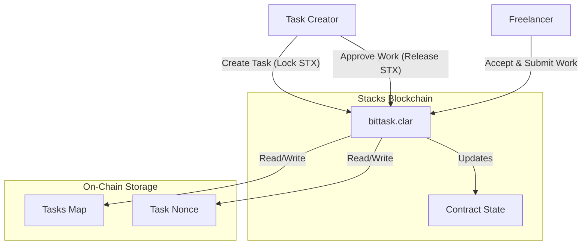
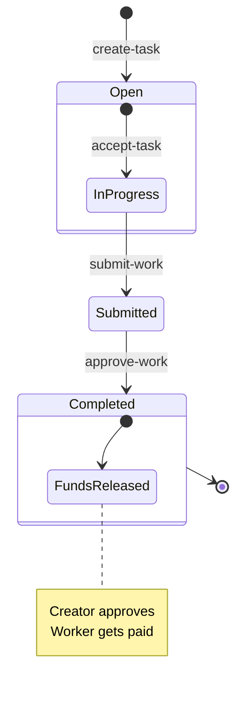

# BitTask - Decentralized Microgigs Marketplace

**BitTask** is a decentralized tasks marketplace built on **Stacks (Bitcoin L2)**. It enables users to post tasks with rewards paid in STX or sBTC, and allows workers to complete these tasks and get paid trustlessly via smart contracts.

  

## 🎯 Multi-Token Contract Implementation

This repository now includes a **comprehensive multi-token ecosystem** built on Stacks blockchain, featuring ERC1155-compatible contracts with advanced DeFi functionality.

### 🚀 Quick Start - Multi-Token Contracts

```bash
# Navigate to contracts
cd contracts

# Install dependencies
npm install

# Run tests
npm test

# Deploy to testnet
PRIVATE_KEY=your-key npm run deploy:testnet

# Run demo
npm run utils:demo
```

### 📦 Multi-Token Features

- ✅ **ERC1155 Multi-Token Contract** - Core functionality with batch operations
- ✅ **Token Factory** - Deploy and manage multiple token contracts  
- ✅ **Marketplace** - Trading platform with fee collection
- ✅ **Staking System** - Reward pools and token staking
- ✅ **Cross-Chain Bridge** - Multi-blockchain token transfers
- ✅ **DAO Governance** - Token-based voting and proposals
- ✅ **Auction System** - Bidding and reserve price auctions

### 📚 Multi-Token Documentation

- [**Multi-Token Implementation Guide**](./MULTI_TOKEN_IMPLEMENTATION.md) - Complete technical documentation
- [**Implementation Summary**](./IMPLEMENTATION_SUMMARY.md) - Overview and achievements
- [**Contracts README**](./contracts/README.md) - Development and usage guide
- [**Contract Specifications**](./.kiro/specs/multi-token-contract/) - Requirements and design

---

## 🏗 System Architecture

The project consists of a Clarity smart contract (`bittask`) that manages the state of all tasks and holds funds in escrow. Users interact with the contract directly or through a Next.js frontend application.



## 🔄 Workflow

The lifecycle of a task follows a linear flow from creation to completion or dispute.



## ✨ Features

- **Create Tasks**: Users can post tasks with a title, description, deadline, and STX reward.
- **Trustless Escrow**: Funds are locked in the smart contract upon task creation, ensuring the creator cannot withhold payment arbitrarily.
- **Automated Bookkeeping**: The contract tracks the status, assignees, and history of every task.
- **Transparency**: All task data and payment flows are publicly verifiable on the Stacks blockchain.
- **Security**: Leveraging Bitcoin's security through the Stacks Proof of Transfer (PoX) mechanism.

## 🛠 Prerequisites

Ensure you have the following installed:

- [Node.js](https://nodejs.org/) (v18+)
- [Clarinet](https://github.com/hirosystems/clarinet) (for local smart contract dev)
- [Git](https://git-scm.com/)

## 🚀 Installation

1.  **Clone the repository**
    ```bash
    git clone https://github.com/Cyberking99/BitTask.git
    cd BitTask
    ```

2.  **Install Frontend Dependencies**
    ```bash
    cd frontend
    npm install
    ```

3.  **Configure Environment Variables**
    Create a `.env.local` file in the `frontend` directory:
    ```bash
    cd frontend
    echo "NEXT_PUBLIC_STACKS_NETWORK=testnet" > .env.local
    ```
    
    Set `NEXT_PUBLIC_STACKS_NETWORK` to `testnet` for development or `mainnet` for production.


## 🧪 Testing

Detailed testing instructions for smart contracts can be found in [contracts/README.md](contracts/README.md).

## 📜 Deployment

The project includes scripts to facilitate deployment to the Stacks network (Testnet/Mainnet).

1.  **Configure Environment**
    Ensure your `Clarinet.toml` and settings files are set up.

2.  **Run Deploy Script**
    ```bash
    clarinet deploy --config Clarinet.toml --settings settings/Testnet.toml
    ```

## 💻 Usage

### Smart Contract Functions

| Function | Type | Description |
| :--- | :--- | :--- |
| `create-task` | Public | Creates a new task with title, description, reward, and deadline. |
| `get-task` | Read-Only | Retrieves details of a specific task. |
| `get-nonce` | Read-Only | Retrieves the current total number of tasks. |
| `accept-task` | Public | Assigns a worker to an open task. |
| `submit-work` | Public | Submits proof of work for a task in progress. |
| `approve-work` | Public | Approves submitted work and releases payment to worker. |

See [Frontend Documentation](frontend/README.md) for UI components and usage.

## 🤝 Contributing

Contributions are welcome! Please see [CONTRIBUTING.md](CONTRIBUTING.md) for guidelines.

## 📄 License

This project is licensed under the MIT License.

## 📋 Changelog

See [CHANGELOG.md](CHANGELOG.md) for recent updates.
